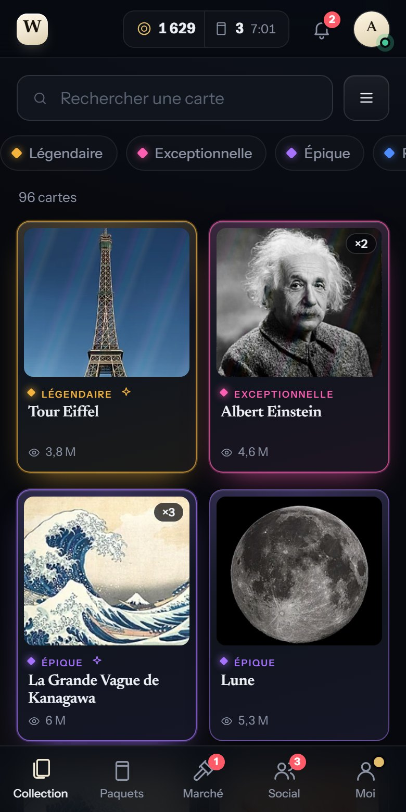
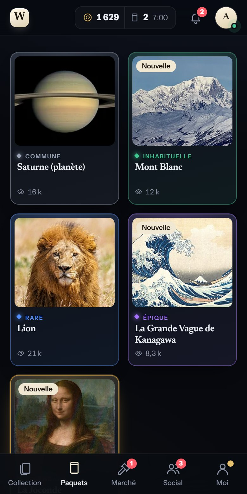
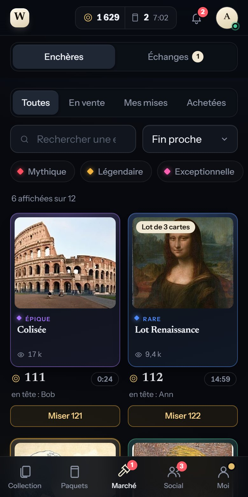
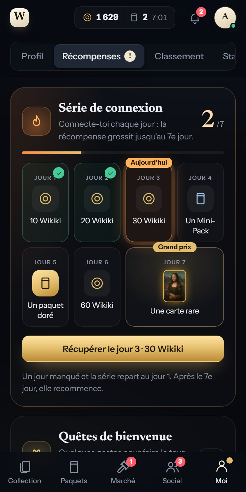
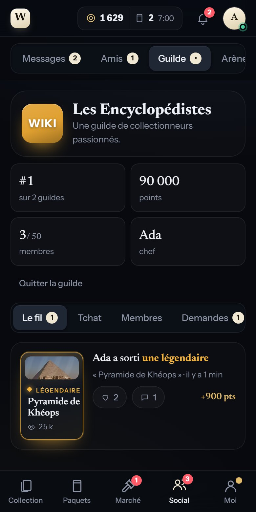
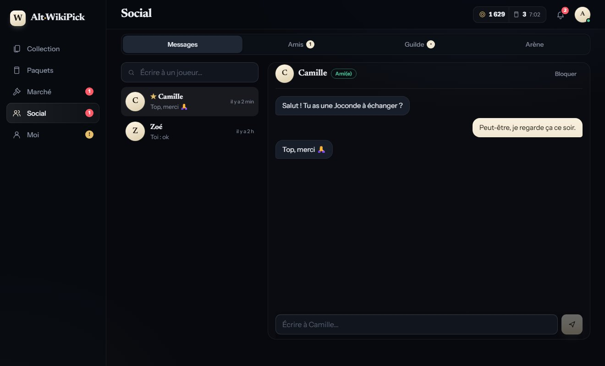

<div align="center">

# Alt-WikiPick

**Deux façons de jouer à [wiki-pick.com](https://wiki-pick.com), le jeu de cartes dont les cartes sont des articles Wikipédia : une appli Windows et une version web pensée pour le téléphone, à héberger chez soi.**

Collection, paquets, marché aux enchères en direct, échanges, guilde, messagerie, récompenses… dans une interface sombre, sobre et rapide.

 &nbsp;  &nbsp; 

</div>

> [!NOTE]
> Projet **non officiel**, sans lien avec wiki-pick.com. Le site n'a pas d'API publique : les deux versions reproduisent les appels que fait son propre site. Voir [Avertissements](#avertissements).

## Choisir sa version

| | **Version web** (mobile d'abord) | **Appli Windows** |
|---|---|---|
| Pour qui | téléphone, tablette, ordinateur ; plusieurs joueurs sur une instance | un joueur sur son PC |
| Installation | héberger une instance ([guide](docs/SELF-HOSTING.md)) puis ouvrir l'adresse ; installable comme une appli (PWA) | télécharger le zip, lancer `WikiPickDesktop.exe` |
| Connexion | pseudo et mot de passe, transmis une seule fois à wiki-pick.com par **ton** serveur | la vraie page de wiki-pick.com dans une fenêtre : le mot de passe ne passe jamais par l'appli |
| Menus | 5 onglets en bas (Collection, Paquets, Marché, Social, Moi), sous-onglets par thème | barre latérale regroupée en Jeu / Communauté / Toi |
| Arène (duels) | salon et Mini-Pack ; le rejeu des duels arrive | complète |

## Pourquoi ce projet ?

Alt-WikiPick existe à cause d'un **manque d'optimisation de la version de base** : avec une grosse collection, des centaines d'images et un flux d'enchères en direct, le site web peut devenir lent et gourmand en ressources. Ces alternatives visent une expérience plus fluide et plus légère, avec les mêmes fonctions.

Ce qui change concrètement :

- **Affichage immédiat** : la dernière collection connue est gardée en cache (sur le disque au bureau, dans le navigateur sur le web) et s'affiche dès l'ouverture, puis se met à jour en arrière-plan.
- **Défilement virtuel (web)** : seules les cartes visibles existent dans la page. Mesuré sur une collection de 3 904 cartes (la taille d'un vrai joueur), navigateur de bureau simulant un téléphone : **12 à 14 cartes dans la page et environ 1 500 éléments, contre 76 000 éléments quand toute la liste est dessinée** ; la mémoire JavaScript reste autour de 10 Mo et la première carte apparaît en 0,5 s (0,8 s avec un processeur ralenti 4 fois).
- **Léger à télécharger (web)** : environ **45 Ko de code et 95 Ko de polices** (compressés) au premier chargement ; chaque écran est un petit fichier (quelques Ko) téléchargé seulement quand on y va. Ensuite, le service worker garde le tout en cache.
- **Un seul flux temps réel**, filtré côté Python : seuls les événements qui te concernent arrivent à l'interface, les enchères ne sont suivies que sur l'écran Marché, et la version web coupe le flux quand l'onglet est caché. Plusieurs appareils d'un même joueur partagent une seule connexion vers wiki-pick.com.
- **Peu d'appels réseau** : un appel pour le profil, un pour la collection par actualisation, pas de sondage agressif ; les vignettes sont demandées à la taille utile.
- **Sans framework lourd** : la version web est compilée par Svelte (pas de bibliothèque d'exécution volumineuse) ; l'appli Windows est en HTML, CSS et JavaScript simples et démarre en environ une seconde.

> Ce sont des mesures de l'appli elle-même et des choix de conception, pas un banc d'essai contre le site : aucune comparaison chiffrée avec lui n'est publiée ici. Le site reste la référence du jeu ; ces clients s'appuient sur lui, sans rien lui retirer.

## Version web

<p>
 &nbsp;

</p>


- **Mobile d'abord** : onglets en bas à portée de pouce, feuilles modales qui montent du bas, champs qui ne déclenchent pas le zoom d'iOS, zones de sécurité (encoche, barre d'accueil) respectées. Sur grand écran, les onglets deviennent une colonne à gauche.
- **Installable** (PWA) : ajoute-la à l'écran d'accueil ; l'interface s'ouvre instantanément, même avec un réseau lent.
- **Multi-utilisateurs** : chacun son compte du jeu, sur une instance que tu contrôles (`ALTWP_ALLOWED_USERS`, `ALTWP_MAX_USERS`).
- **Auto-hébergeable** : un conteneur Docker, HTTPS par un reverse proxy, données dans un seul dossier. Tout est expliqué dans [**docs/SELF-HOSTING.md**](docs/SELF-HOSTING.md).

```bash
git clone https://github.com/acotinier/Alt-WikiPick.git && cd Alt-WikiPick
cp .env.example .env     # définis au moins ALTWP_SECRET
docker compose up -d --build
```

Pour essayer l'interface sans compte ni serveur : `cd webapp && npm install && npm run dev:mock` (mot de passe de la démo : `demo`).

## Appli Windows

### Télécharger

1. Va dans [**Releases**](../../releases) et télécharge `Alt-WikiPick-windows.zip`.
2. Décompresse le dossier où tu veux (garde tout son contenu ensemble).
3. Lance `WikiPickDesktop.exe`.

Prérequis : Windows 10 ou 11 à jour (Microsoft Edge WebView2, déjà présent). Aucune installation, aucun droit administrateur.

Au premier lancement, Windows SmartScreen peut afficher « Windows a protégé votre ordinateur » : l'exécutable n'est pas signé. Clique sur *Informations complémentaires* puis *Exécuter quand même*. Tu peux aussi [le construire toi-même](#construire-lappli-windows) à partir du code.

### Ce que fait l'appli

| | |
|---|---|
| **Collection** | Toute ta collection, recherche, filtres (rareté, tag, doublons), tris, fiche de carte avec l'extrait Wikipédia et la provenance de tes exemplaires. |
| **Paquets** | Ouverture animée, carte par carte, avec un journal de tes paquets et ta chance mesurée face aux probabilités annoncées. |
| **Marché** | Les enchères mises à jour en direct, en grille ou en liste. Miser, vendre, suivre tes mises, historique des achats et ventes, **cartes surveillées** avec alerte. |
| **Échanges** | Proposer, accepter, refuser, contre-proposer, entre amis. |
| **Arène** | Combats à deux en direct, decks, Mini-Pack. |
| **Communauté** | Messagerie, amis (favoris, blocage), profils avec collection et vitrines, guilde (fil, tchat, membres, demandes). |
| **Récompenses** | Série de connexion sur 7 jours, quêtes du jour, quêtes de bienvenue, succès. |
| **Et aussi** | Classement, statistiques, doublons recyclables et corbeille, recherche rapide `Ctrl+K`, raccourcis `1`–`9`, sons optionnels, export CSV. |

<table>
<tr>
<td width="50%"></td>
<td width="50%"></td>
</tr>
<tr>
<td></td>
<td></td>
</tr>
</table>

### Lancer depuis les sources

Prérequis : Windows, Python 3.10+ (commande `py`) et WebView2.

```bat
git clone https://github.com/acotinier/Alt-WikiPick.git
cd Alt-WikiPick
desktop\run.bat
```

`run.bat` crée un environnement virtuel au premier lancement, installe les dépendances (`requests`, `pywebview`) et démarre l'appli.

### Construire l'appli Windows

```bat
desktop\build.bat
```

Le script installe PyInstaller, construit le dossier `dist\WikiPickDesktop\` (mode `--onedir` : démarrage immédiat) puis le zip `dist\Alt-WikiPick-windows.zip`. Pour publier une release :

```bat
gh release create v0.1.0 dist\Alt-WikiPick-windows.zip --title "v0.1.0" --notes "…"
```

## Confidentialité et sécurité

- **Appli Windows** : ton mot de passe ne passe jamais par l'appli (vraie page de connexion de wiki-pick.com). Tout reste sur ton ordinateur, dans `%APPDATA%\WikiPickDesktop` ; « Se déconnecter » supprime la session et le cache. Aucun serveur intermédiaire, aucune télémétrie.
- **Version web** : le serveur envoie tes identifiants **une seule fois** à wiki-pick.com et ne les garde pas ; il conserve seulement les cookies de session, **chiffrés**, et te donne un cookie propre (`HttpOnly`, `SameSite=Lax`, `Secure`). Pendant la connexion, le mot de passe passe donc par le serveur : héberge-le toi-même ou n'utilise qu'une instance de confiance. Détails et protections dans [docs/SELF-HOSTING.md](docs/SELF-HOSTING.md).
- Les textes venus d'autres joueurs (noms de cartes, messages…) sont toujours affichés comme du **texte**, jamais comme du HTML ; les images n'acceptent que les hôtes Wikimedia ; les liens ne s'ouvrent que vers Wikipédia et wiki-pick.com ; l'adresse e-mail de ton compte n'est jamais transmise à l'interface.
- Le journal de diagnostic du flux temps réel ne contient que des **noms** d'événements, jamais de valeurs.

## Avertissements

- **Aucune automatisation.** Un clic = une action, une à la fois, avec confirmation quand elle engage des pièces ou des cartes. Pas de mise automatique, pas d'ouverture de paquets en boucle, rien qui joue à ta place. Ni l'appli ni le serveur ne répondent **jamais** à la vérification « es-tu un robot ? » du site : elle te pose la question et transmet ton clic.
- Volontairement absents : l'administration, les paiements, les fonctions réservées aux abonnés WIKI-PRO si tu ne l'es pas.
- **Les conditions d'utilisation du jeu n'ont pas été lues.** Un client tiers est utilisé à tes risques ; si tu l'utilises, l'héberges pour d'autres ou le diffuses, prévenir le développeur du jeu est une bonne idée.
- **État du projet** : le décodage de la collection et des paquets, et la question de vérification de la connexion web, ont été confrontés à de vraies réponses du site ; tout le reste (marché, enchères, échanges, arène, messagerie, guilde, récompenses, connexion par identifiants) suit les formats lus dans le JS public du site et n'a pas été entièrement observé en conditions réelles. L'image Docker n'a pas encore été construite par l'auteur. Si un écran est vide ou décalé, ouvre une [issue](../../issues).

## Tests

```bash
pip install -r requirements-dev.txt
pytest tests                       # noyau, appli Windows et serveur web (84 tests, rapides, sans réseau)
playwright install chromium
python tests/ui_smoke.py           # interface de l'appli Windows, dans Chromium
(cd webapp && npm install) && python tests/web_smoke.py    # interface web de bout en bout
```

- `pytest` : décodage des formats du site, client HTTP, validation de chaque écriture, flux temps réel, et pour le serveur : connexion, sessions chiffrées, liste blanche des appels, limites de débit, événements partagés entre appareils, isolation des joueurs.
- `ui_smoke.py` et `web_smoke.py` : pilotent toute l'interface dans Chromium avec un faux serveur, vérifient les parcours (paquets avec vérification, enchères, échanges, guilde, récompenses…), l'absence d'injection HTML, la mise en page (aucun débordement à 320 et 390 px pour le web, 900 px pour le bureau) et le poids de la page pour une très grosse collection.

> Ne lance jamais `Api()` (bureau) dans un script sans rediriger `APPDATA` vers un dossier temporaire : `logout()` supprimerait ta vraie session.

## Architecture

```
wikipick/               Le noyau, partagé par le bureau et le web
  service.py            Toute la logique du jeu pour UN joueur : lectures, écritures validées, fichiers locaux
  client.py             Client HTTP (requests) vers wiki-pick.com : session, cookies, tous les appels
  parse.py, social.py   Décodage des réponses du site (collection compacte, enchères, guilde, quêtes…) sur liste blanche
  live.py, stream.py    Flux temps réel : une seule connexion, champs filtrés, file d'événements
  store.py, export.py   Fichiers JSON locaux (écriture atomique), export CSV sûr
desktop/                L'appli Windows : app.py (fenêtre pywebview), web/ (interface sans build), build.bat, run.bat
server/                 Le serveur web (FastAPI) : connexion, sessions chiffrées, appels sur liste blanche, événements
webapp/                 L'interface web (Svelte 5 + Vite) : src/routes (un écran = un fichier), src/ui, src/lib
docs/                   API.md (les endpoints du site et leur fiabilité), SELF-HOSTING.md, captures d'écran
tests/                  Tests unitaires, serveur, et rendu des deux interfaces
```

Le principe : **une seule logique, deux interfaces**. `wikipick.service.Service` contient tout ce qu'un joueur peut faire ; le bureau l'expose à sa fenêtre (pywebview), le serveur web l'expose à chaque navigateur derrière une liste blanche de méthodes (`server/rpc.py`). Quand le site change de format, on corrige à un seul endroit. Toutes les méthodes renvoient un dictionnaire `{ok, error?, …}` : aucune exception ne traverse vers l'interface. Tout ce qui part vers le site passe par une validation stricte et par `Service._write` (une écriture à la fois, journal local, jamais rejouée).

Les formats de données du site ne sont pas documentés : [`docs/API.md`](docs/API.md) recense ce qui est vérifié, ce qui est lu dans le JS du site et ce qui reste inconnu. Pour chaque nouvel endpoint, commence par lire le JS public du site, écris le test de décodage avec une réponse réaliste (données anonymisées), puis l'écran.

## Crédits

- Interface : polices **Newsreader** et **Instrument Sans** ([SIL OFL 1.1](desktop/web/fonts/OFL.txt)), embarquées pour fonctionner hors ligne (la version web en sert des extraits allégés).
- Images des cartes : [Wikimedia Commons](https://commons.wikimedia.org), chargées depuis les serveurs de Wikimedia ; textes issus de [Wikipédia](https://fr.wikipedia.org) (CC BY-SA).
- Captures d'écran : données de démonstration, sans rapport avec un compte réel.

## Licence

[MIT](LICENSE) © 2026 acotinier
