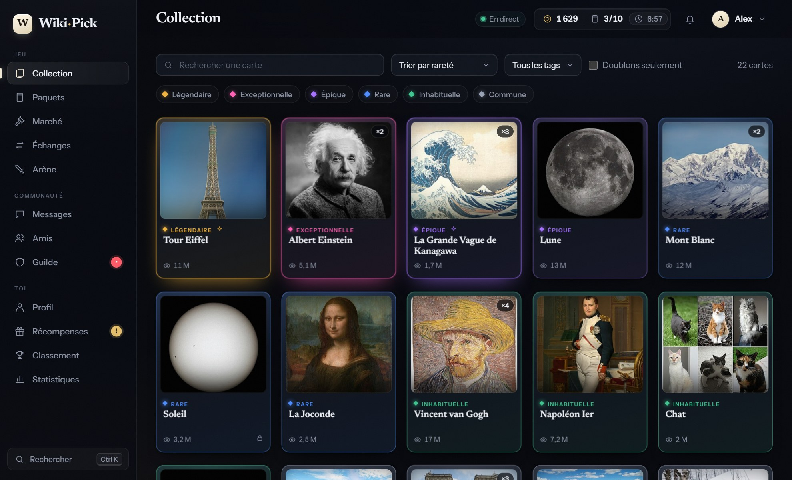
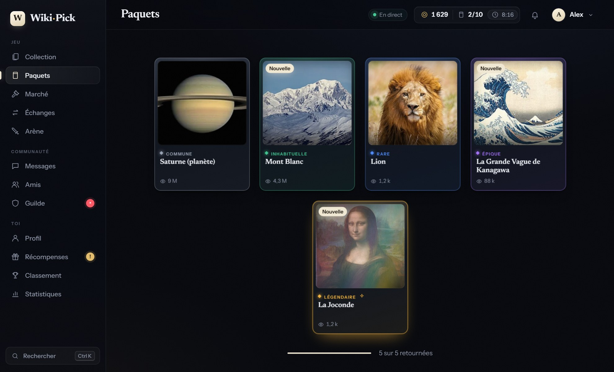
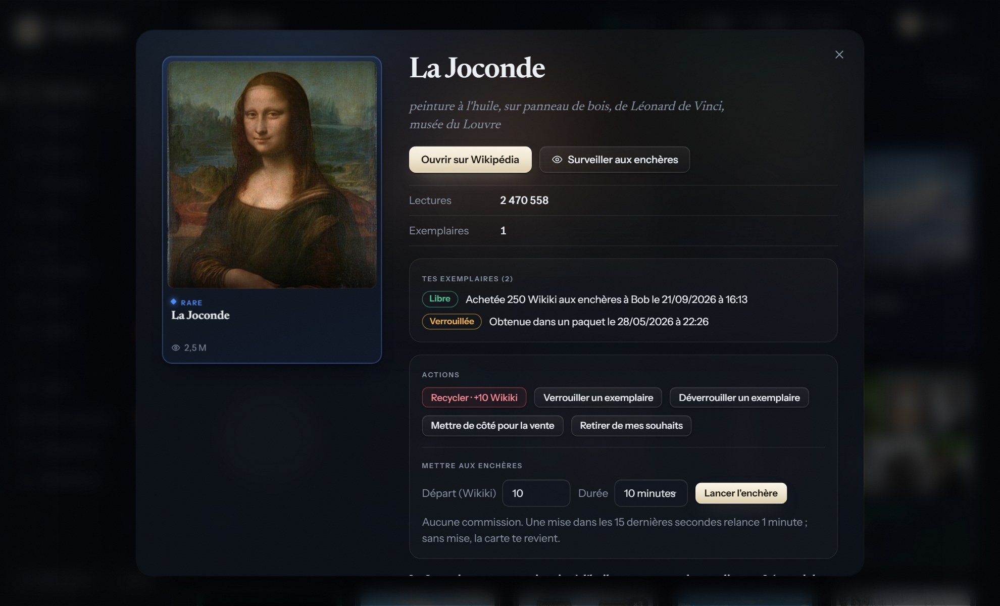
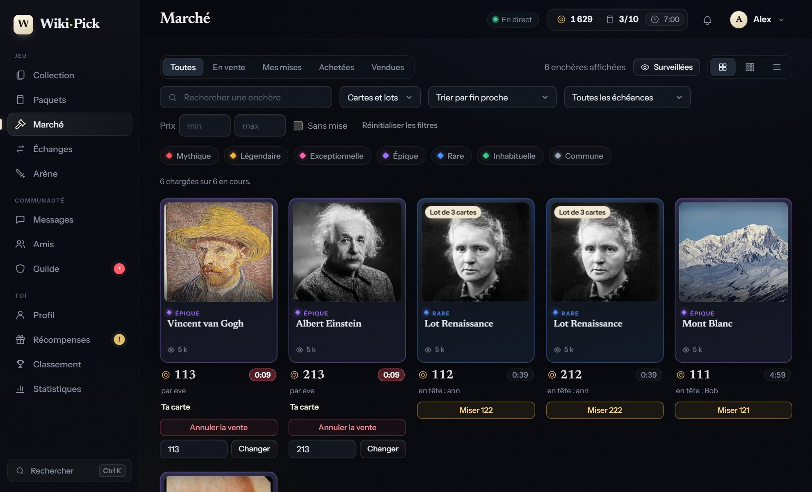
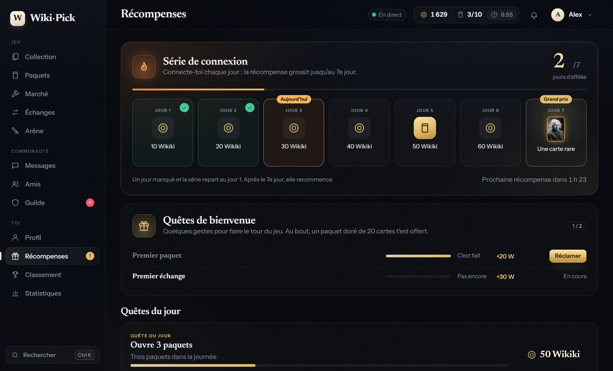
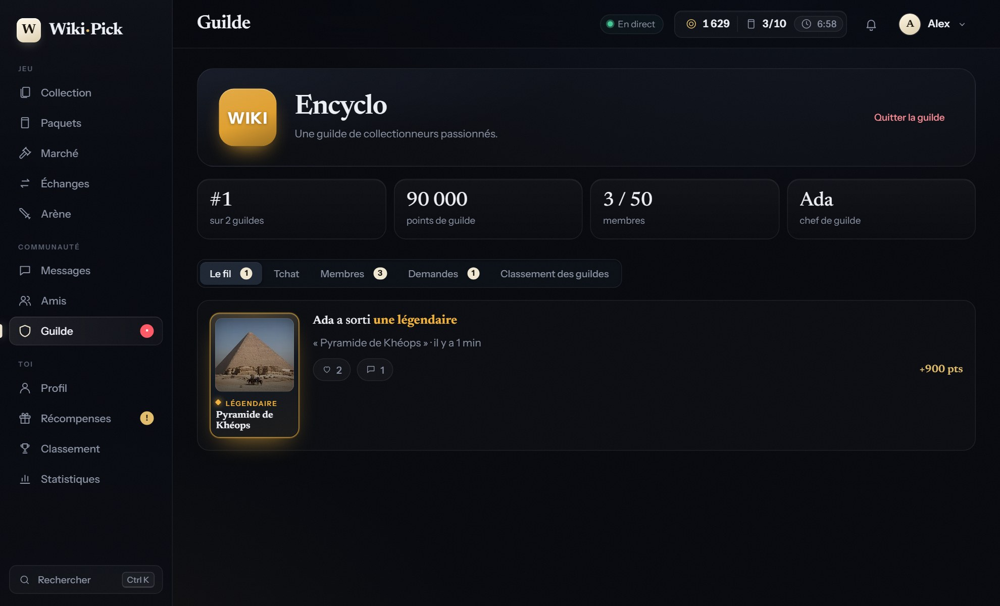
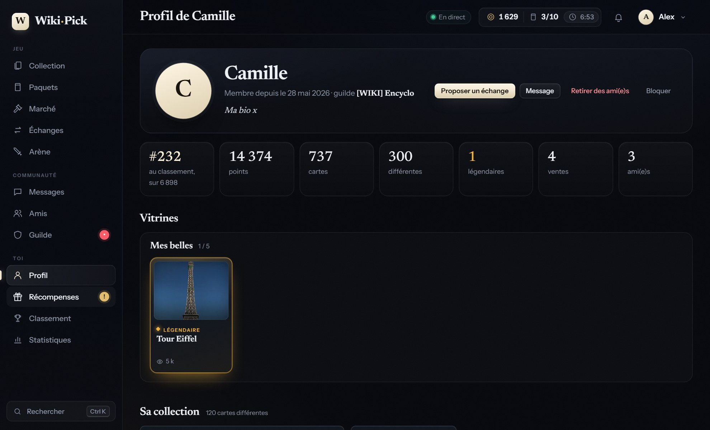

<div align="center">

# Alt-WikiPick

**Un client de bureau Windows pour [wiki-pick.com](https://wiki-pick.com), le jeu de cartes dont les cartes sont des articles Wikipédia.**

Collection, paquets, marché aux enchères en direct, échanges, guilde, arène, messagerie… dans une interface pensée pour durer : sombre, sobre, rapide.



</div>

> [!NOTE]
> Projet **non officiel**, sans lien avec wiki-pick.com. Le site n'a pas d'API publique : l'appli reproduit les appels que fait son propre site. Voir [Avertissements](#avertissements).

## Pourquoi ce projet ?

Alt-WikiPick existe à cause d'un **manque d'optimisation de la version de base** : avec une grosse collection, des centaines d'images et un flux d'enchères en direct, le site web peut devenir lent et gourmand en ressources. Cette alternative vise une expérience plus fluide et plus légère, avec les mêmes fonctions.

Ce qui change concrètement :

- **Affichage immédiat** : la dernière collection connue est gardée en cache sur le disque et s'affiche dès l'ouverture, puis se met à jour en arrière-plan.
- **Rendu progressif** : les cartes sont dessinées par paquets de 60 au fil du défilement, plutôt que toute la collection d'un coup.
- **Un seul flux temps réel**, filtré côté Python : seuls les événements qui te concernent arrivent à l'interface, et les enchères ne sont suivies que lorsque l'onglet Marché est ouvert.
- **Peu d'appels réseau** : un appel pour le profil, un pour la collection par actualisation, pas de sondage agressif.
- **Une interface sans framework ni étape de build** : quelques centaines de ko de HTML, CSS et JavaScript, et un démarrage d'environ une seconde.

> C'est un constat d'utilisation et un choix de conception, pas un banc d'essai : aucune mesure comparative n'est publiée ici. Le site reste la référence du jeu, et cette appli ne le remplace pas (elle s'appuie sur lui, sans rien lui retirer).

## Télécharger

1. Va dans [**Releases**](../../releases) et télécharge `Alt-WikiPick-windows.zip`.
2. Décompresse le dossier où tu veux (garde tout son contenu ensemble).
3. Lance `WikiPickDesktop.exe`.

Prérequis : Windows 10 ou 11 à jour (Microsoft Edge WebView2, déjà présent). Aucune installation, aucun droit administrateur.

Au premier lancement, Windows SmartScreen peut afficher « Windows a protégé votre ordinateur » : l'exécutable n'est pas signé. Clique sur *Informations complémentaires* puis *Exécuter quand même*. Tu peux aussi [le construire toi-même](#construire-lappli) à partir du code.

## Ce que fait l'appli

| | |
|---|---|
| **Collection** | Toute ta collection, recherche, filtres (rareté, tag, doublons), tris, fiche de carte avec l'extrait Wikipédia et la provenance de tes exemplaires. Affichage instantané au démarrage grâce à un cache local. |
| **Paquets** | Ouverture animée, carte par carte, avec un journal de tes paquets et ta chance mesurée face aux probabilités annoncées. |
| **Marché** | Les enchères mises à jour en direct, en grille ou en liste. Miser, vendre, suivre tes mises, historique des achats et ventes, **cartes surveillées** avec alerte. |
| **Échanges** | Proposer, accepter, refuser, contre-proposer, entre amis. |
| **Arène** | Combats à deux en direct, decks, Mini-Pack. |
| **Communauté** | Messagerie, amis (favoris, blocage), profils avec collection et vitrines, guilde (fil, tchat, membres, demandes). |
| **Récompenses** | Série de connexion sur 7 jours, quêtes du jour, quêtes de bienvenue, succès. |
| **Et aussi** | Classement, statistiques, doublons recyclables et corbeille, recherche rapide `Ctrl+K`, raccourcis `1`–`9`, sons optionnels, export CSV. |

<table>
<tr>
<td width="50%"></td>
<td width="50%"></td>
</tr>
<tr>
<td></td>
<td></td>
</tr>
<tr>
<td></td>
<td></td>
</tr>
</table>

## Confidentialité et sécurité

- **Ton mot de passe ne passe jamais par l'appli.** « Se connecter » ouvre la vraie page de wiki-pick.com (mot de passe, Google, Discord…) ; l'appli récupère seulement le cookie de session.
- Tout reste **sur ton ordinateur**, dans `%APPDATA%\WikiPickDesktop` : `session.json` (accès à ton compte : ne le partage jamais), cache de collection, préférences, journaux. « Se déconnecter » supprime la session et le cache.
- Aucun serveur intermédiaire, aucune télémétrie : l'appli ne parle qu'à wiki-pick.com (et charge les images depuis Wikimedia).
- Les textes venus d'autres joueurs (noms de cartes, messages…) sont toujours affichés comme du **texte**, jamais comme du HTML ; les images n'acceptent que les hôtes Wikimedia ; les liens ne s'ouvrent que vers Wikipédia et wiki-pick.com ; l'adresse e-mail de ton compte n'est jamais transmise à l'interface.
- Le journal de diagnostic du flux temps réel ne contient que des **noms** d'événements, jamais de valeurs.

## Avertissements

- **Aucune automatisation.** Un clic = une action, une à la fois, avec confirmation quand elle engage des pièces ou des cartes. Pas de mise automatique, pas d'ouverture de paquets en boucle, rien qui joue à ta place. L'appli ne répond **jamais** à la vérification « es-tu un robot ? » du site : elle te pose la question et transmet ton clic.
- Volontairement absents : l'administration, les paiements, les fonctions réservées aux abonnés WIKI-PRO si tu ne l'es pas.
- **Les conditions d'utilisation du jeu n'existe pas.**
- **État du projet** : le décodage de la collection et des paquets vient de vraies réponses du site ; tout le reste (marché, enchères, échanges, arène, messagerie, guilde, récompenses) suit les formats lus dans le JS public du site et n'a pas été entièrement observé en conditions réelles. Si un écran est vide ou décalé, ouvre une [issue](../../issues).

## Lancer depuis les sources

Prérequis : Windows, Python 3.10+ (commande `py`) et WebView2.

```bat
git clone https://github.com/acotinier/Alt-WikiPick.git
cd Alt-WikiPick
run.bat
```

`run.bat` crée un environnement virtuel au premier lancement, installe les dépendances (`requests`, `pywebview`) et démarre l'appli.

## Construire l'appli

```bat
build.bat
```

Le script installe PyInstaller, construit le dossier `dist\WikiPickDesktop\` (mode `--onedir` : démarrage immédiat) puis le zip `dist\Alt-WikiPick-windows.zip`. Pour publier une release :

```bat
gh release create v0.1.0 dist\Alt-WikiPick-windows.zip --title "v0.1.0" --notes "…"
```

## Tests

```bat
pip install -r requirements-dev.txt
pytest tests
playwright install chromium
python tests\ui_smoke.py
```

- `pytest` : décodage des formats du site, client HTTP, validation de chaque écriture, filtre du flux temps réel (68 tests, rapides, sans réseau).
- `ui_smoke.py` : rend toute l'interface dans Chromium avec une fausse API `pywebview` et vérifie les parcours (paquets, enchères, échanges, guilde, récompenses…), l'absence d'injection HTML et la mise en page à 900 px.

> Ne lance jamais `Api()` dans un script sans rediriger `APPDATA` vers un dossier temporaire : `logout()` supprimerait ta vraie session.

## Architecture

```
app.py                  Point d'entrée : fenêtre pywebview + classe Api exposée au JavaScript
wikipick/client.py      Client HTTP (requests) : session, cookies, tous les appels
wikipick/parse.py       Décodage de la collection compacte, paquets, enchères, échanges, arène…
wikipick/social.py      Décodage messagerie, amis, profils, guilde, quêtes, série, succès
wikipick/stream.py      Décodeur Server-Sent Events
wikipick/live.py        Flux temps réel : une seule connexion, liste blanche de champs, file d'événements
wikipick/store.py       Fichiers JSON locaux (écriture atomique)
wikipick/export.py      Export CSV sûr (cellules neutralisées contre l'injection de formules)
web/                    Interface en HTML / CSS / JS sans dépendance ni étape de build
docs/API.md             Les endpoints de wiki-pick.com et leur niveau de fiabilité
tests/                  Tests unitaires et rendu de l'interface
```

Le choix de **Python + pywebview** : le client HTTP reste en Python (pas de CORS, un seul processus), l'interface est du HTML moderne rendu par le moteur d'Edge. Toutes les méthodes de `Api` renvoient un dictionnaire `{ok, error?, …}` : aucune exception ne traverse le pont vers le JavaScript. Tout ce qui part vers le site passe par une validation stricte et par `Api._write` (une écriture à la fois, journal local, jamais rejouée).

Les formats de données du site ne sont pas documentés : [`docs/API.md`](docs/API.md) recense ce qui est vérifié, ce qui est lu dans le JS du site et ce qui reste inconnu. Pour chaque nouvel endpoint, commence par lire le JS public du site, écris le test de décodage avec une réponse réaliste (données anonymisées), puis l'écran.

## Crédits

- Interface : polices **Newsreader** et **Instrument Sans** ([SIL OFL 1.1](web/fonts/OFL.txt)), embarquées pour fonctionner hors ligne.
- Images des cartes : [Wikimedia Commons](https://commons.wikimedia.org), chargées depuis les serveurs de Wikimedia ; textes issus de [Wikipédia](https://fr.wikipedia.org) (CC BY-SA).
- Captures d'écran : données de démonstration, sans rapport avec un compte réel.

## Licence

[MIT](LICENSE) © 2026 acotinier
